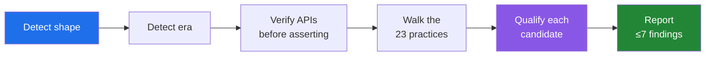

<div align="center">

# expert-langchain

**A code-review skill for LangChain & LangGraph — 23 practices, validated against real production repos.**

[](LICENSE)
[](SKILL.md)
[](VALIDATION.md)
[](VALIDATION.md)
[](CONTRIBUTING.md)

*Find the defects that matter. Skip the noise. Never manufacture a finding.*

</div>

---

Most LangChain review advice is a style guide — import order, naming, "use the latest API." That's not
where production agents break.

This skill is organised around where defects **actually** cluster in real codebases, which — across a
13-repo audit of everything from a 152k-star platform to 1k-star agent templates — is almost never the
architecture:

| Failure class | What it looks like in the wild |
|:--|:--|
| 🎭 **Guarantee asserted, weakly implemented** | `or True` quietly killing an error classifier · a parse failure defaulting to a confident verdict · "read-only" enforced by `startswith` |
| ⏱️ **Correct logic, wrong lifetime or frequency** | a cache with no eviction · a DB commit per LLM call · a shared singleton mutated per request |
| 🔓 **Authorization assumed, never enforced** | a handler — or an **agent tool** — that fetches a resource by id with no owner check |

That third class produced **both** high-severity findings in the audit, and most review checklists miss
it entirely. → [VALIDATION.md](VALIDATION.md)

## Quick start

**With an agent harness (Claude Code, etc.)** — drop this folder into your skills directory and invoke
it by name, or simply point an agent at `SKILL.md`:

```
Review this repo with expert-langchain.
```

**By hand** — `SKILL.md` is a self-contained checklist. Work the procedure top to bottom.

## How the review works



The **procedure** matters as much as the practices:

- **Detect shape first.** A graph-native app is not a `create_agent` app — demanding middleware imports
  where they don't belong is the top source of false positives.
- **Verify before asserting.** A confidently wrong correction is worse than no review. Principles are
  stable; kwargs are not.
- **Qualify before investing.** Is it reachable on a *default* path? Already reported? Is the repo even
  maintained? Three cheap checks that prevent most wasted effort — and most over-called severity.
- **Never manufacture findings.** *"Two findings and a long N/A list"* is a valid review.

## What's inside

```
SKILL.md                            the skill — procedure + 23 practices (start here)
VALIDATION.md                       the golden set: every repo audited, findings, lessons
references/notes.md                 rationale, evidence, verified API signatures
references/gold-standard-agent.py   a reference agent to copy the shape from
```

## Validation

This skill is **tested against real code, and the misses are recorded too.**

| | |
|:--|:--|
| Repos audited | **13** |
| High-severity findings | **2** — both authorization-class |
| Filed / disclosed upstream | **3** |
| Already reported by others | 1 |
| Clean control cases | 2 |

Every change to the rubric is traceable to the specific audit that exposed the gap. Full breakdown,
including LangChain-depth ratings per repo → [VALIDATION.md](VALIDATION.md)

> `VALIDATION.md` follows a strict disclosure policy: security findings are named only once already
> public. **It will never be the first public mention of an unfixed vulnerability.**

## Contributing

The most valuable contribution is **an audit** — run the skill on a LangChain repo and add the result
to the golden set, including the false leads. Second most valuable: **an audit that disproves a
practice.** A rubric that can't be wrong isn't measuring anything.

See [CONTRIBUTING.md](CONTRIBUTING.md) · [SECURITY.md](SECURITY.md) · [Code of Conduct](CODE_OF_CONDUCT.md)

## License

[MIT](LICENSE)
